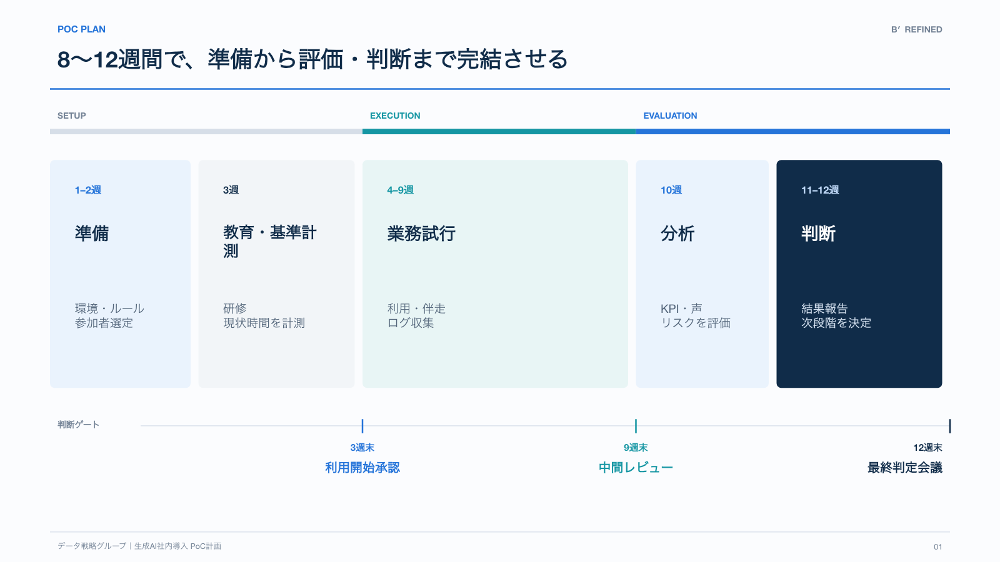
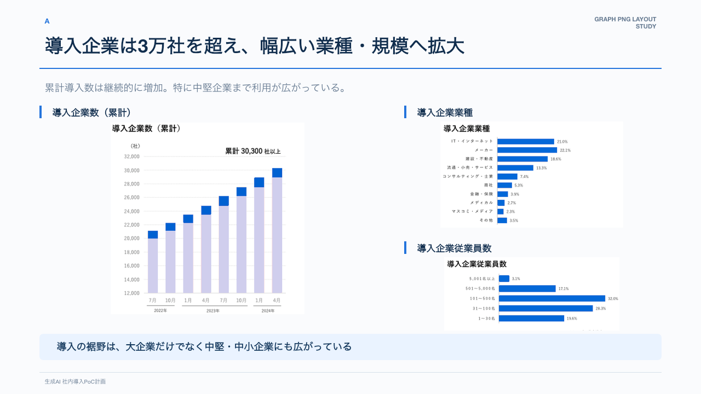
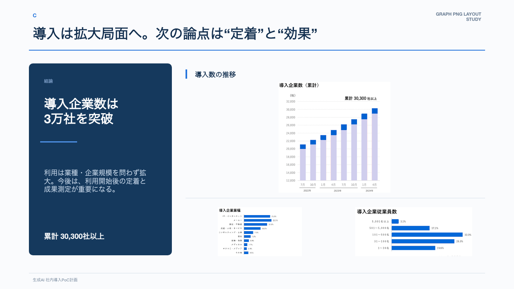
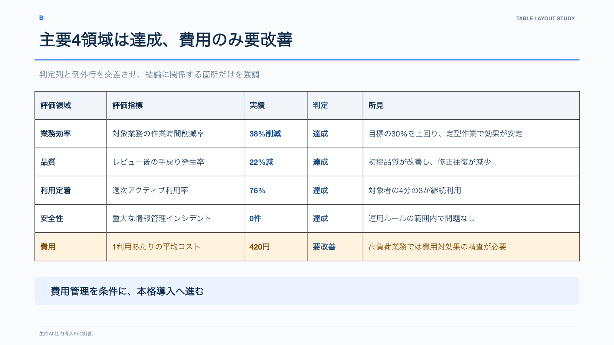
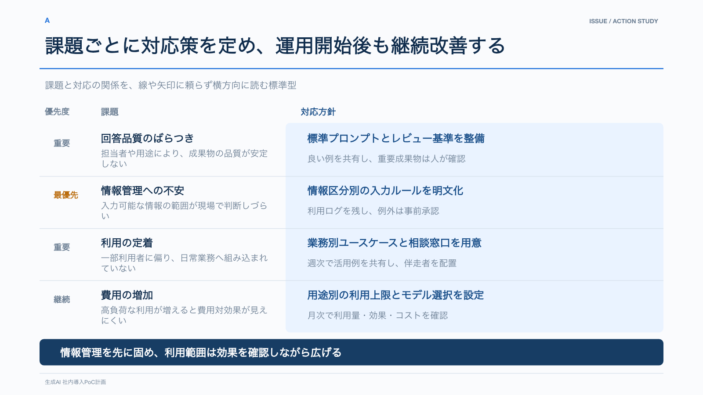
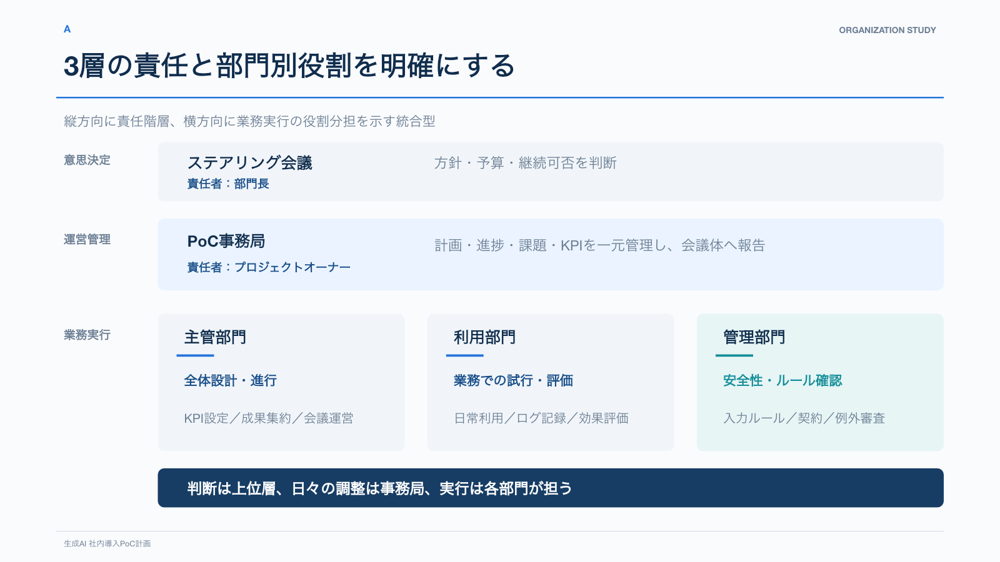

# Layout Patterns

該当するページを作るときだけ画像を見る。例をそのまま複製せず、内容に合う構造、強調の優先順位、読順を抽出する。

## プロセスと判断ゲート

対応renderer: `process_with_gates`

- フェーズは上段、作業は中央、判断ゲートは下段の専用軸へ分離する。
- ゲートの目盛りを工程上の時点へ正確に揃える。
- フェーズとゲートを同じ行へ混在させず、縦の接続線を増やさない。
- 固定しないもの: フェーズ数、期間、ゲート数、各領域の幅。

## PNGグラフ: 標準型

対応renderer: `chart_with_insight` / `variant: standard`

- データ全体を公平に見せるときに使う。
- 主グラフを大きくし、補助グラフを同じ右カラムに積む。
- セクション見出しは短い青線と文字で示し、Cardで囲わない。
- 下段の淡色結論は、データ全体の意味を短くまとめる。

## PNGグラフ: 結論主導型

対応renderer: `chart_with_insight` / `variant: conclusion-led`

- 一つの主張を強く伝える必要があるときに使う。
- 濃色面の主張を一つに限定し、グラフは根拠として従属させる。
- 制作ラベルを避け、必要なら「結論」を控えめに置く。
- 標準型より常に優先するのではなく、メッセージの強さで選ぶ。

## 表: 例外行と結論

対応renderer: `table_with_conclusion`

- 結論を左右する行だけ淡色背景を使う。
- 判定列など次に見てほしい箇所は、背景ではなく文字色と太さで示す。
- 行と列の背景色を交差させない。
- 罫線は薄いグレーとし、下段の結論面は主張の強さに応じて淡色または濃紺を選ぶ。

## 課題と対応策

対応renderer: `priority_actions`

- 左に優先度と課題、右に淡い背景の対応方針を置く。
- 最優先だけアクセント色を使い、他の優先度はグレー文字で示す。
- 矢印を使わず、同じ行と背景領域から対応関係を読ませる。
- 強い判断が一つある場合だけ、下段へ濃紺の結論面を置く。

## 組織: 階層と横の役割

対応renderer: `org_layers`

- 上段に意思決定、中段に運営管理、下段に業務実行を置く。
- 業務実行層は部門別に横分割し、縦の責任階層と混同させない。
- 接続線を使わず、位置と背景面で構造を示す。
- ハブ型は、連絡経路や集約先が主題の場合だけ選ぶ。

## 避けるパターン

- 空白を埋めるための情報パネル、ロゴ、説明文。
- フェーズ、ゲート、作業を一つの行へ詰め込む。
- 表の行と列を同時に着色し、交差部分を作る。
- 同じ強度の濃色面を複数置く。
- 関係図で縦線・横線・矢印を増やし、線が主役になる。
- すべてのスライドへ同じ結論ボックスを置く。
- `KEY MESSAGE`などのラベルで結論らしさを補う。
- 角丸、Card、影をページ内の全要素へ一律に適用する。
