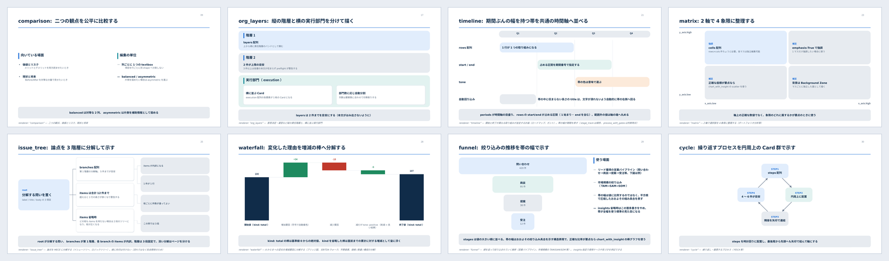

# build-corporate-slides

社内説明・企画・提案・報告向けの、編集可能なPowerPointを構成設計から生成するClaude Codeスキル。

*A Claude Code skill that plans, generates and validates editable Japanese corporate PowerPoint decks. Slides are produced deterministically from YAML by a Python engine (python-pptx), not exported as images — every shape stays editable in PowerPoint. Documentation is in Japanese.*


## これは何か

YAMLで「何をどう伝えるか」を書くと、レイアウト・配色・文字サイズ・余白を決め打ちしたPythonエンジンが、そのままPowerPointを生成する。

- **出力は編集可能なPPTX。** 画像を貼り込むのではなく、テキストボックス・図形・ネイティブチャート・表として組む。受け取った人がPowerPoint上でそのまま直せる。
- **見た目を毎回考え直さない。** 配色・タイポグラフィ・余白は`theme.py`のトークンに集約してあり、ページごとに個別指定しない。
- **生成の前後で検証する。** 書いた内容は生成前に`preflight`が、出来たPPTXは`validate_pptx`が、それぞれ別の観点で点検する。

PLAN（構成を決める）・CREATE（作る）・REVISE（指摘を受けて直す）の3モードで扱う。

## 何ができるか

意味の型ごとに20種類のrendererを持つ。比較、根拠と結論、対象と対象外、工程とゲート、表、グラフ、階層、優先度、段階、タイムライン、2軸マトリクス、論点分解、実績数値、増減の分解、ファネル、循環など。



- 全20種の実物見本 → [`capability-showcase.pdf`](.claude/skills/build-corporate-slides/user-guide/capability-showcase.pdf)（30ページ。配色・タイポグラフィの実寸比較・コンポーネント・アイコン・チャートを、使用したPython関数名付きで一覧できる）
- 内容のある資料として組み立てた例 → [`samples/`](samples/)（7デッキ。YAMLとPDFの対）

型に合うものが無い場合は、`Region.columns()` / `rows()` を使って個別に組んだページを`extra_renderers`として差し込める。preflightの共通契約は保ったまま拡張できる。

## 設計

### 4層に分ける

`slidekit`は下から **Layout → Atom → Fragment → Renderer** の4層で積む。各層は自分より下だけに依存する。

| 層 | 役割 | ビジネス語彙 |
|---|---|---|
| **Layout** | 矩形領域の分割と余白計算。描画は一切しない | 持たない |
| **Atom** | 図形・文字・アイコン・グラフ・表という単独の部品 | 持たない |
| **Fragment** | Region＋項目リストからN個の配置を計算し、中身を埋めるRegionを返す | 持たない |
| **Renderer** | 上記を組み合わせ、意味を持った1ページを完成させる | **持つ** |

AtomとFragmentの境界は「1つの位置を受け取って部品を返す」か「Region＋リストを受け取ってN個のRegionを返す」かの一点だけで判定する。ビジネス語彙がrenderer層より下へ漏れないことを、この分け方で担保している。詳細は[`ARCHITECTURE.md`](.claude/skills/build-corporate-slides/runtime/python/slidekit/ARCHITECTURE.md)。

### 二段構えで検証する

| | 何を見るか | 落ちるもの |
|---|---|---|
| **preflight**（生成前） | YAMLの構造・必須フィールド・型・件数の上限 | 内容の書き方の誤り |
| **validate_pptx**（生成後） | スライド外への逸脱、枠からの文字あふれ、図形の重なり、7pt未満の文字、文章の過剰分割 | レイアウトの破綻 |

内容起因の失敗（`ContentError`）と描画中のエラーを別扱いにしてあり、生成スクリプトがどちらなのかを利用者へ正しく伝えられる。

### 文字量を実測してから置く

レイアウトの破綻はほとんどが「入れてみたら入らなかった」で起きる。`textmetrics.py`で文字幅を実測し、収まる高さと項目間隔を先に計算してから配置する。項目間隔は「余白 : 項目間隔 ≈ 1.3〜1.5 : 1」を満たす値を解いて求める（`centered_gap_pt`）。

### 自動検証で見えないものがある

上の検証はいずれも構造しか見ない。実際、目視で監査したところ、**構造検証を全て通過したうえで壊れているもの**が見つかった。

- 本文が見出しの書式・サイズで描画されていた（python-pptxが`\n`をそのまま書くと、改行後の文字が直前のrunの書式を引き継ぐ。正しいOOXMLは`<a:br/>`要素）
- 棒グラフの縦軸が0から始まっておらず、棒の長さが量を表していなかった
- 親子を結ぶ折れ線が、PowerPointの自動経路に任せた結果、描画ソフト側で箱に重なっていた

いずれも座標としては正しく、構造検証では原理的に検知できない。修正するたびに回帰確認デッキへ1ページ追加し、PDFで目視できるようにしている（[`build_regression_check.py`](.claude/skills/build-corporate-slides/scripts/build_regression_check.py)）。

### 判断そのものを文章で持つ

コードで決め打ちできない判断は、`references/`に文章として置いてある。どのrendererを選ぶか、情報量が多すぎるページをどう分割するか、色をいつ意味に使うか、といったもの。

| ファイル | 内容 |
|---|---|
| [`slide-planning.md`](.claude/skills/build-corporate-slides/references/slide-planning.md) | 構成の決め方、ページ分割の判断 |
| [`design-system.md`](.claude/skills/build-corporate-slides/references/design-system.md) | 配色・タイポグラフィ・余白の規則 |
| [`visual-quality.md`](.claude/skills/build-corporate-slides/references/visual-quality.md) | 読みやすさの基準、避けるべき状態 |
| [`renderer-catalog.md`](.claude/skills/build-corporate-slides/references/renderer-catalog.md) | 20種のrendererと選択基準 |
| [`content-model.md`](.claude/skills/build-corporate-slides/references/content-model.md) | YAMLの構造 |
| [`powerpoint-production.md`](.claude/skills/build-corporate-slides/references/powerpoint-production.md) | 編集性・引継ぎやすさの制約 |
| [`image-handling.md`](.claude/skills/build-corporate-slides/references/image-handling.md) | 画像の扱い |

## 構成

```text
.claude/skills/build-corporate-slides/
├── SKILL.md                  # スキルの入口。PLAN / CREATE / REVISE
├── references/               # 設計原則・renderer catalog（AIが読む）
├── user-guide/               # 使い方・部位名称一覧（人間が読む）
├── runtime/python/slidekit/  # PowerPoint生成エンジン
└── scripts/                  # 検証・レンダリング・自己テスト

samples/                      # 生成したデッキの実例（YAML＋PDF）
docs/images/                  # このREADMEの図
```

## 手元で動かす

スキルは`.claude/skills/build-corporate-slides/`の中で完結している。動かして確かめる場合は、このディレクトリごとコピーする。置き場所は2通りある。

```bash
# プロジェクト単位（そのプロジェクトでだけ使う）
mkdir -p <対象プロジェクト>/.claude/skills
cp -r .claude/skills/build-corporate-slides <対象プロジェクト>/.claude/skills/

# ホーム直下（全プロジェクトで使う）
mkdir -p ~/.claude/skills
cp -r .claude/skills/build-corporate-slides ~/.claude/skills/
```

**スキル本体の置き場所と、作業領域の置き場所は独立している。** ホーム直下に1つ置いても、設定ファイル（`.slide-skill-config.yaml`）と`build_slides/`は各プロジェクト側に作られるため、部署名・開示区分・ロゴ・生成物はプロジェクトごとに別になる。同名のスキルが両方にある場合はホーム側が優先される（Claude Codeの規則）。

スキルの外に必要なものは3つ。

| | 必要性 |
|---|---|
| `.slide-skill-config.yaml`（プロジェクト直下） | 無くても生成はできるが、部署名・開示区分・ロゴが入らない。[`.slide-skill-config.example.yaml`](.claude/skills/build-corporate-slides/user-guide/.slide-skill-config.example.yaml)をコピーして編集する |
| python-pptx / PyYAML / Pillow | 必須。[`requirements.txt`](.claude/skills/build-corporate-slides/runtime/python/requirements.txt)が基準 |
| LibreOffice等 | PDF化と目視確認にのみ必要。PPTXの生成自体には不要 |

作業領域の`build_slides/`は、スキルが必要に応じて自動で作る。設定項目の一覧と最初の1本の流れは[`getting-started.md`](.claude/skills/build-corporate-slides/user-guide/getting-started.md)にある。

### 動作確認

```bash
# 全rendererを最小構成で1枚ずつ生成・検証する自己テスト
python3 .claude/skills/build-corporate-slides/scripts/self_test.py

# 過去の不具合を再現する回帰確認デッキ
python3 .claude/skills/build-corporate-slides/scripts/build_regression_check.py
python3 .claude/skills/build-corporate-slides/scripts/validate_pptx.py build_slides/output/skill-regression-check.pptx

# 実物見本（capability-showcase）の再生成
python3 .claude/skills/build-corporate-slides/scripts/build_capability_showcase.py

# サンプルPDFを最新の実装へ揃える
python3 samples/render_samples.py
```

## このリポジトリについて

社内資料を作るために自分用に整えた仕組みを、そのまま置いている。

公開しているのは成果物というより、そこに入っている考え方のほうである。本文は12ptを基準にする、余白と項目間隔の比をあらかじめ決めておく、文字量を実測してレイアウトの破綻を防ぐ——といった判断は`references/`に文章として書いてあり、コードより先にそちらを読んだほうが早い。

ライセンスは付けていない。そのままコピーして使うものとしてではなく、考え方を読むものとして置いているため。手元で動かす手順は書いてあるが、それは中身を確かめるためのもの。

設計と実装はClaude Codeとの共同作業で進めた。方針の決定、出力の確認、直すべき点の判断は筆者が行っている。

## 保証しないこと

- 目視確認はLibreOfficeでPDF化して行っている。PowerPoint本体での表示は、フォント置換により細部が異なる場合がある。
- 日本語フォント（Hiragino Sans / Yu Gothic等）が導入済みであることを前提にしている。
- `samples/`のうち04〜07は公開情報を調べて作成した。作成時点（2026年8月）の情報であり、**スキルの出力例であって内容の正確性を保証するものではない**。数値を引用する場合は一次情報を確認すること。
